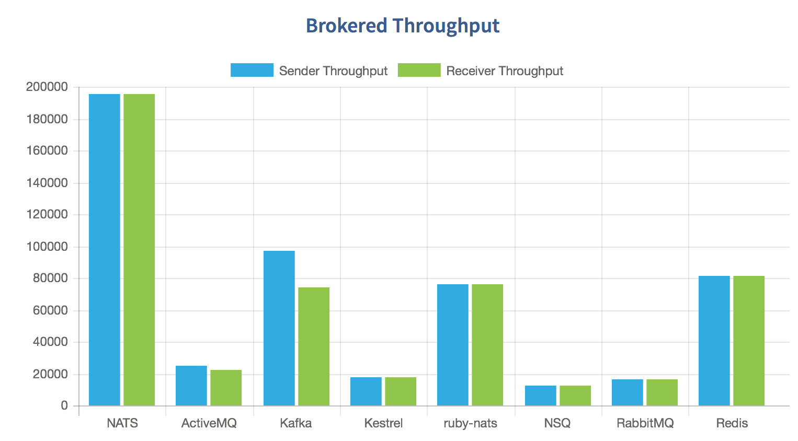

### Grofers task
grof CLI, modern key value manager

<br/>

[](https://angadsharma1016.github.io/grofers-task/)


[](https://youtu.be/7RiZiqKRWkk)

<br/>
<br/>

---
## <a id="index"></a>Index

<br/>

[Technology stack used](#tech)

[Why nats](#nats)

[How to setup](#setup)

[How to run](#run)

[How to stop](#stop)

[How to build from source](#build)

[How to setup custom secrets](#secrets)

[file structure overview](#fs)

[file structure tree](#tree)

---


<br/>
<br/>
<br/>


<details open>

<summary id="tech">Technology stack used</summary>

<br/>

- [X] Golang + MySQL
- [X] NATS as a high availability messaging queue service
- [X] docker + docker-compose
- [X] bash scripts
- [X] apidoc documentation

### <a id="nats"></a>Why NATS?
---
[NATS](https://github.com/nats-io/go-nats.git) is an event sourcing tool which we will be using to publish logs and distribute related data between different services. The reason for NATS is:

* RabbitMQ is limited to HTTP and HTTPS natively

* NATS supports gRPC and works fast due to being type safe as well as removing extra overhead of marshalling and unmarshalling

* Publishing events on a different thread and subscribing from a different thread allows non-blocking log sourcing.

* NATS is very high throughput when it comes to requests per second

<a href = "#index" > </a>

<br />



<br />
</details>

<a href = "#index" > </a>

<br/>
<br/>

### <a id="setup"></a>How to setup
`Note`: For ease, a sample .env has been pushed with the repo

```
$ git clone https://github.com/angadsharma1016/grofers-task.git && cd grofers-task

$ chmod +x ./bin/*

$ ./bin/setup
```
<a href = "#index" > </a>

Wait for config after ./bin/setup, you can use `docker-compose logs -f` to monitor changes.

<br/>
<br/>

### <a id="run"></a> How to run

```
$ grof
```

After running `grof` you will see something like this:


```
================================= grof CLI ==============================


Usage: 
grof put [key] [value] --------------------> Set key-value
grof get [key] ----------------------------> Get value from key
grof delete [key] -------------------------> Delete from DB
grof update [key] [new value] -------------> Update DB with new value
grof watch --------------------------------> Subscribe to changes in DB
grof watch --------------------------------> Watch for realtime DB changes
```
<a href = "#index" > </a>


<br/>

### <a id="stop"></a> How to stop
To kill the server, database and messaging service simple do

```
./bin/clean
```

<br/>
<br/>

### <a id="build"></a> How to build from source
If you want to build from source simple do the following

```
go build -o ./bin/grof ./main.go 
sudo cp ./bin/grof /use/local/bin/grof
```


<br/>
<br/>

### <a id="secrets"></a>How to setup custom secrets
Make sure you have a .env file in your project root with the following fields. You can edit any field in .env and run `docker-compose build` for custom secrets.

| Key | Value |
|:---:|:-----:|
| MYSQL_ROOT_PASSWORD | your root password for MySQL |
| MYSQL_USER | your user for the database |
| MYSQL_PASSWORD | The password for your user |
| MYSQL_DATABASE | The database to use in MySQL |


<a href = "#index" > </a>

<br/>
<br/>


<details open>

<summary id="fs">File structure explanation</summary>

* `server/`: Has the API for key value CRUD operations while publishing events
* `pb/`: Describes the protocol buffer struture for event communication
* `model/`: Has all of the MySQL connection logic and CRUD functions
* `cli/`: Registers os ARGS and decides which function to call
* `./cli/watch.go`: Subscribes to an event and then waits indefinately
* `./cli/*`: CRUD operations on SQL, and with each operation, an event is published unique to the o/p
* `bin/`: Has all of the compiled code and bash executables
* `vendor`: Godeps vendor, has all of the vendored code
* `docs/`: Has docs generated with the apidoc CLI
* `./server/apidoc.json`: apidoc config for docs generation


<a href = "#index" > </a>

<br/>

### <a id="tree"></a>File structure tree
```
.
├── bin/
│   ├── clean*
│   ├── grof*
│   └── setup*
├── cli/
│   ├── delete.go
│   ├── get.go
│   ├── put.go
│   ├── register.go
│   ├── update.go
│   └── watch.go
├── docker-compose.yml
├── Dockerfile
├── Godeps/
│   ├── Godeps.json
│   └── Readme
├── images/
│   └── nats.png
├── main.go
├── model/
│   ├── conn.go
│   ├── Dockerfile
│   ├── setup.sql
│   └── store.go
├── pb/
│   ├── store.pb.go
│   └── store.proto
├── README.md
├── server/
    ├── apidoc.json
    ├── controller/
    │   ├── delete.go
    │   ├── get.go
    │   ├── put.go
    │   ├── router.go
    │   └── update.go
    └── main.go
```
</details>
<a href = "#index" > </a>
